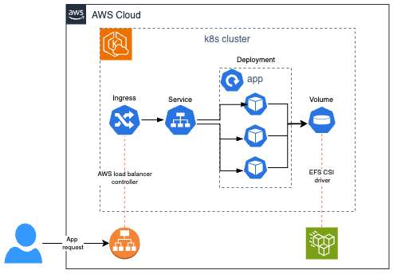
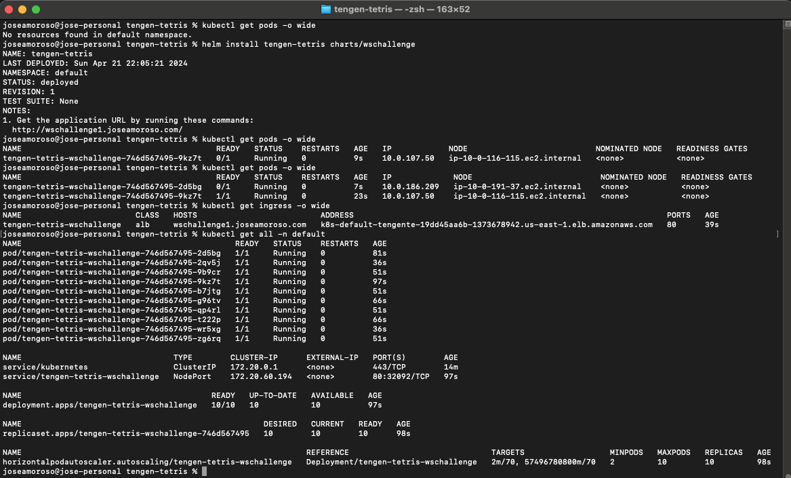
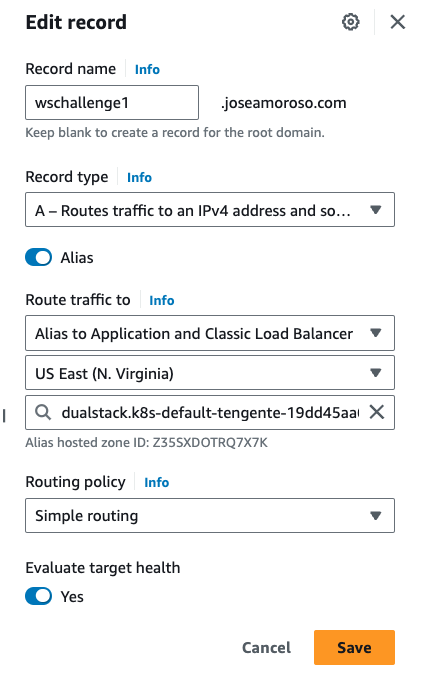
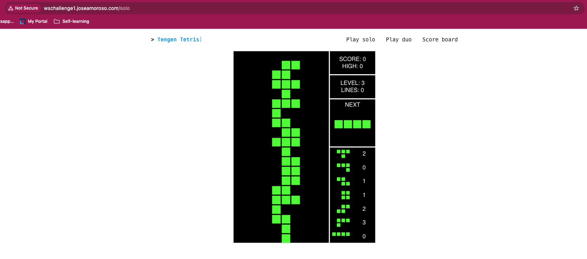
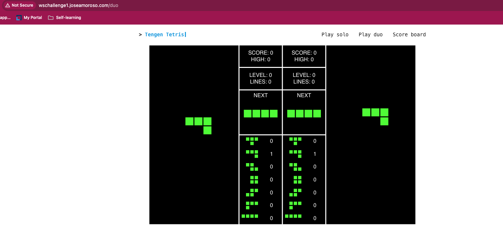
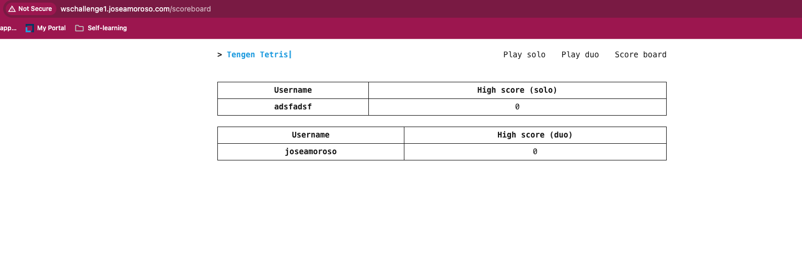

# CHALLENGE DOCUMENTATION

This document provides a description of the solution implemented for this challengem, as well as explanations of the tools and strategies implemented.
For the instructions on how to deploy the application with helm charts please refer to [README.md](./README.md/#option-2-kubernetes-and-helm).

## Challenge

[X] Run the application locally.

[X] Build a Docker image with the webapp source code requirements and publish it in Dockerhub.

[X] Create k8s manifests to deploy the application. Consider the architecture according to the use case and requirements.

[X] Generate a Helm chart from k8s manifests created in the previous step. This chart should be customizable through values file.

[X] Deploy the chart in the Kubernetes cluster and verify its working properly.

[X] Add support for dynamic host ip and port values to the python app. These values should be passed from the Helm chart.

[X] Deploy new version of the app and Helm chart to the cluster. This deployment should have a minimal impact in the app usage.

## Architecture

To deploy the Kubernetes cluster we use an EKS cluster from AWS. To deploy the infrastructure we used eks blueprints aws-cdk, the repo could be found here: <https://github.com/joseamoroso/tengen-tetris-ws-challenge-infra>. It deploys all AWS resources required for the cluster, including the Kubernetes addons: metrics-server, aws load balancer controller and EFS csi driver. Next, you can see a diagram of the proposed solution:

### Architecture review

We use AWS EKS to provide the k8s cluster where we deploy the application. For the kubernetes architecture design:

- **Application Deployment**: The Python webapp will be deployed in Kubernetes + AWS Cloud. We are not refactoring the app, so no major changes in the source code are accepted. This will be more like a replatform migration.
- **Deployment Configuration**: We use a Deployment to define the containers that will execute the application (included deployment settings like environment variables).
- **Service Exposure**: A kubernetes service expose the pods routing internally. If the user enables the ingress, the service type is ignored because we are using the annotation `alb.ingress.kubernetes.io/target-type: ip` , but if the user wants to expose the application through the server, then `NodePort` type should be used.
- **Ingress Usage**: We chose the ingress because it allows us to put our servers/intances in private subnets (improved security), and route the traffic with an ingress; in this case because we are using AWS we use the aws load balancer controller, which map an application load balancer to the ingress. We expose the load balancer in a public subnet.
- **Scalability and Persistence**: Thinking in application scaling, we assume we'll need more than 1 node which also means we need an network file system (NFS), so that we can persist and share the database across nodes. For this reason we use EFS csi driver, which allows us to map Kubernetes volumes to EFS volumes. For production environments we should switch from SQLite to a more proper database system like RDS or Aurora, this will remove the requirement of a NFS and improve the application in several ways (specially in reliability)
- **Application autoscaling**: Implemented horizontal pod autoscaling (HPA) to automatically scale in response to user traffic. This also requires metric-server to provider usage metric data for scaling purposes.

### Repository walkthrough

- The Helm chart is defined in the [charts/wschallenge](./charts/wschallenge/) directory. The rest of files corresponds to original `tengen-tetris` app.
- For this challenge, we use a monorepo for the chart and app, but for production environments it's recommended to separate each one and have different values files for each environment. This also means that, for this instructions, the chart dependes on the [values.yaml](./charts/wschallenge/values.yaml) file for any configuration purpose.
- Docker image is composed of three stages, to install dependencies, copy all files and ship the app in the container. The `BUILDPLATFORM` allows us to build images that can support multi-architectures in case we want to use ARM based images.
- We used an alpine version because of the image security, size and simplicity of the application (doesn't requires much dependencies)
- The Gihub wokflow in this repository build and push the image to the public Docker repository: <https://hub.docker.com/repository/docker/jamorosoa/tengen-tetris-ws-challenge-gh> (it requires to defined the repository credentials as secrets). The image tag depends on the Github event. E.g. if we push tag v1.0.0, it will generate the image `jamorosoa/tengen-tetris-ws-challenge-gh:v1.0.0`
- Because this is a minimal implementation no CD for Helm charts was implemented. However, the current approach could be used if we install ArgoCD to manage our apps and charts with GitOps.

### Images/snippets from application

